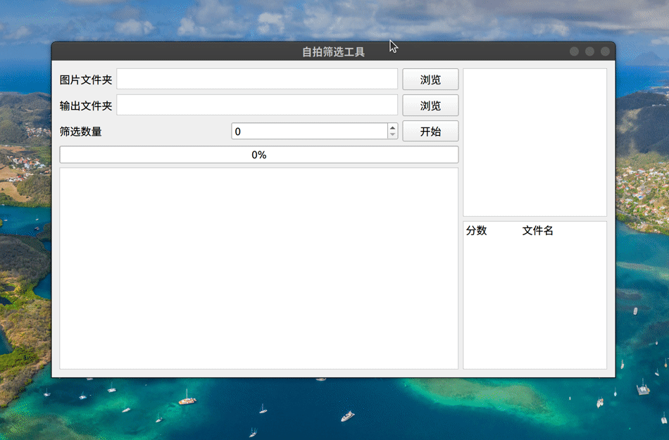

# 自拍筛选工具
基于深度学习颜值评分进行自拍照片筛选，灵感来源：看到[@小众软件 转发的 @睡到人间吃饭时 的微博](https://weibo.com/1684197391/Lb0ggA0rK?type=comment)

## 原理
使用ResNet18模型对文件夹中的每张照片进行评分，排序后将分数最高的n张复制到目标文件夹中。

模型来源：[CharlesPikachu/isBeauty](https://github.com/CharlesPikachu/isBeauty)

部署工具：使用[pnnx](https://github.com/pnnx/pnnx)将PyTorch模型转为[ncnn](https://github.com/Tencent/ncnn)

若对模型效果不满意，可以自行训练替换`models`目录下的模型，或对配置文件`config.ini`中`model`项的路径进行修改。

## 使用方法
1. 从源代码运行
首先安装好需要的包
```bash
$ pip install -r requirements.txt
``` 
随后使用python运行`photo_filter.py`
```bash
$ python photo_filter.py
```

2. 使用编译好的程序（Windows）
下载[photo_filter_windows_x64.zip](https://github.com/CescMessi/photo_filter/releases/download/1.0.0/photo_filter_windows_x64.zip)，解压后双击`photo_filter.exe`运行。

## 使用效果



The emoji graphics are from the open source project [Twemoji](https://twemoji.twitter.com/). The graphics are copyright 2020 Twitter, Inc and other contributors. The graphics are licensed under [CC-BY 4.0](https://creativecommons.org/licenses/by/4.0/). You should review the license before usage in your project.
